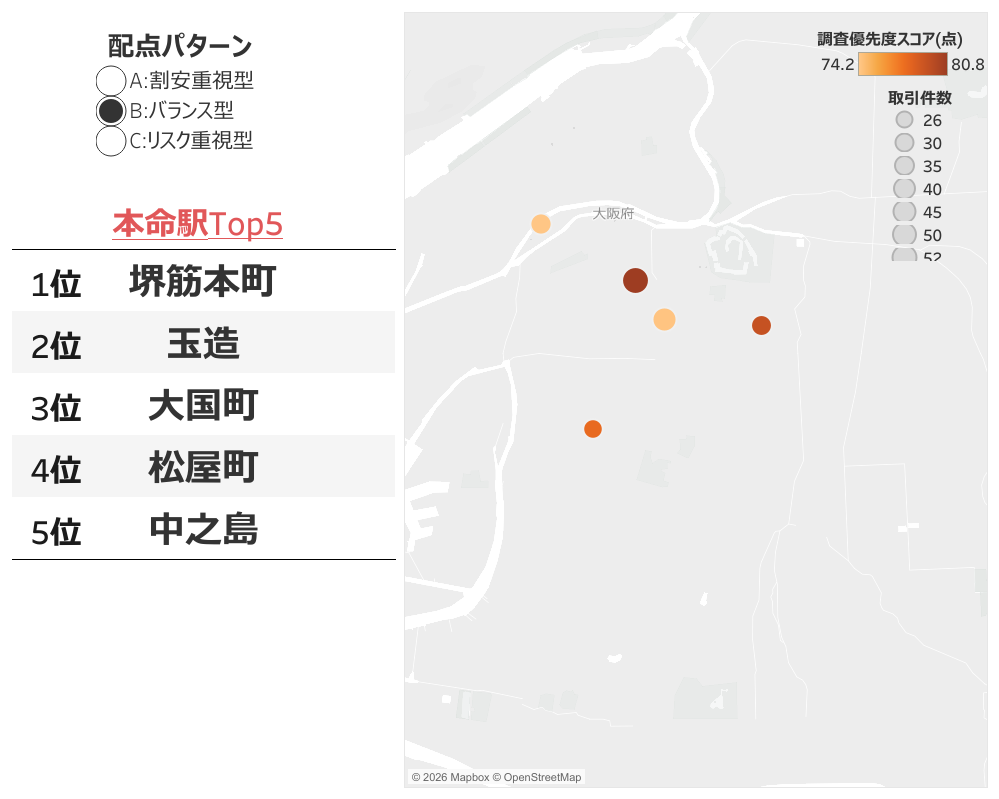
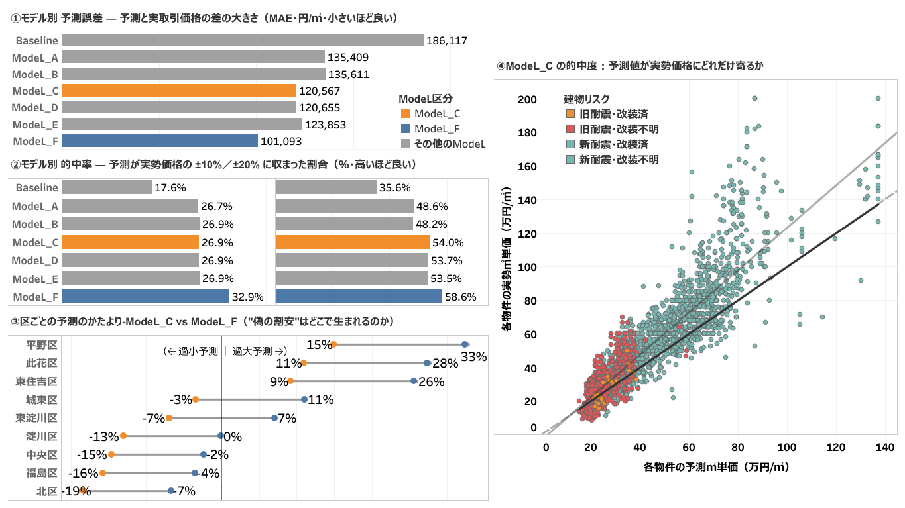
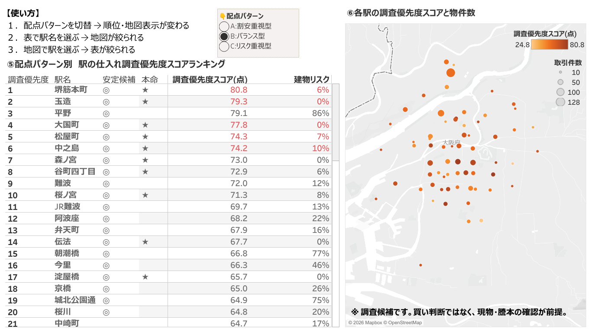
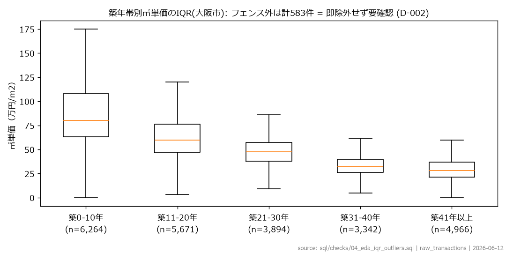
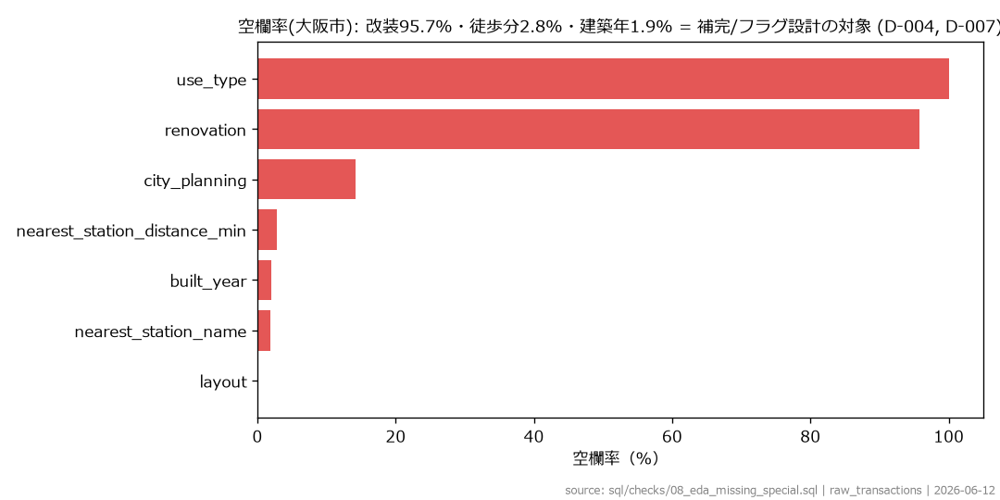
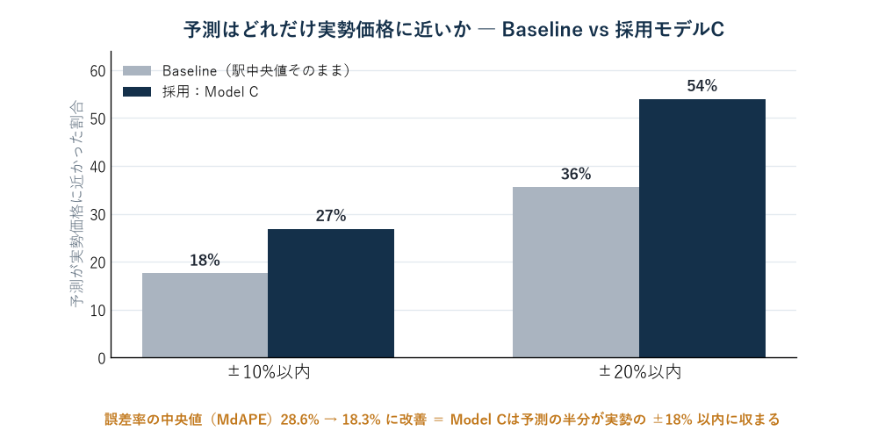

# 大阪市の中古マンション市場分析 ― 仕入れで「次に調べる駅」をデータから絞り込む

中古マンションを安く仕入れたいが、大阪市には駅が **151** もある。「どの駅から優先して調べるか」を人手で全部比較するのは大変。本プロジェクトは、公開データだけで **「次に調査すべき駅」を一次スクリーニングする** 仕組みを作りました（買うべき物件の断定ではなく、調査の優先順位づけ）。

成約価格・駅・地価データから物件ごとの予測㎡単価を算出し、実勢との乖離（割安傾向）に、取引件数・価格安定性・地価・データ品質・建物リスクを加えた **独自スコア** で駅を順位づけ。**151駅 → 調査優先10駅 → 本命5駅**（配点パターン別）まで絞り込みました。

- 📊 **Tableau Public（対話版）**：https://public.tableau.com/shared/KR589GQZX
- 📄 **詳細なポートフォリオ（本体）**：リポジトリ内の `index.html`

---

## 📑 目次

1. [成果](#成果--何を解決したか) ― 151駅を本命5駅に絞った結果
2. [分析概要](#分析概要) ― 課題・全体フロー・技術スタック
3. [使用データ](#使用データ)
4. [前処理](#前処理--外れ値欠損をどう判断したか) ― 外れ値・欠損をどう判断したか
5. [特徴量設計](#特徴量設計--予測に入れる特徴量とスコア項目の分離) ― 予測に入れる特徴量とスコア項目の分離（核心）
6. [モデル構築](#モデル構築--7モデルの積み上げ) ― 7モデルの積み上げとリーク防止
7. [モデル評価](#モデル評価--当てるより駅の順位が崩れないモデルを選ぶ) ― Model Cを選んだ理由とF棄却
8. [スコアリング](#各配点パターンの調査優先度スコア計算方法) ― 5軸の配点と3パターンの感度分析
9. [結果考察](#結果考察--上位駅の自己検証) ― 自分の結果を疑って仕分けた
10. [限界と改善案](#限界と改善案)
11. [再現手順](#再現手順)

---

## Tableau で可視化

> 下記は画面イメージ。**[Tableau Public（操作できる対話版）はこちら](https://public.tableau.com/shared/KR589GQZX)**。実際のダッシュボードでは、配点パターン（バランス／割安重視／リスク重視）の切替や、グラフへのホバーで詳細が見られます。

**① サマリー** ― 配点パターン切替で変わる本命駅Top5と地図


**② モデル選定と検証** ― 7モデル比較・Model C採用理由・予測の検証


**③ 調査優先度の高い駅** ― 配点切替で変わる駅ランキングと地図


---

## 成果 ― 何を解決したか

人手なら151駅ぶんの相場調査が必要な「仕入れの初動」を、**調査すべき10駅まで自動で絞り込み、配点パターン別（割安重視型／バランス型／リスク重視型）本命駅 Top5 を選定する仕組み**を作った。

```
151 駅              66 駅              調査優先 10 駅
相場比較が可能  →  取引10件未満を除外  →  約1/15に圧縮（次に調べる候補）
```

※ **10駅** ＝調査を優先する駅／**本命5駅** ＝そのうち建物リスクが低い駅。

| 配点パターン | 本命 Top5 |
|---|---|
| バランス型（主スコア） | 堺筋本町・玉造・大国町・松屋町・中之島 |
| 割安重視型 | 玉造・大国町・堺筋本町・伝法・森ノ宮 |
| リスク重視型 | 堺筋本町・玉造・大国町・松屋町・谷町四丁目 |

配点パターンを切り替えると順位が変わる。**堺筋本町・玉造・大国町はどのパターンでも上位＝頑健な本命**。割安重視では伝法・森ノ宮、リスク重視では谷町四丁目が浮上する（配点の意図に応じて狙いが動く）。配点の詳細は [docs/scoring_methodology.md](docs/scoring_methodology.md)。

※ スコア最上位は平野（割安重視85.6点）だが、**旧耐震×改装不明が86%**＝典型的な「安いには訳がある」逆選択のため本命から自動除外。

※ **位置づけ：** ここで出すのは「次に**調べる**優先順位」の仮説であり、「買うべき・儲かる」の断定ではない。実際の仕入れ成果（再販利益など）での効果検証は今後の課題。

### 設計で大事にした4つの判断

| 問い | どう考えて、どうしたか |
|---|---|
| **Q1. なぜ一番安い物件を本命にしない？** | 安い物件ほど旧耐震×改装不明（訳あり）が多い＝**逆選択**。額面の安さで選ぶと地雷を掴むので、建物リスクを可視化して本命から外した（例：平野）。 |
| **Q2. なぜ一番"当たる"モデルを使わない？** | 精度が一番高いモデルは郊外を過大予測して「**偽の割安**」を作り順位を壊す。目的は価格当てでなく**駅の順位づけ**なので、精度が高くても見送り、順位が安定するモデルを選んだ。 |
| **Q3. この結論はどこまで信じていい？** | 全数値はコードから再現可能。ただし元データは「成約＝売れ終わった取引」なので、出せるのは"買い"でなく"次に調べる候補"まで。 |
| **Q4. なぜ少数データの激安駅を上位にしない？** | **まぐれ安値**を上位に出したくないので、取引10件未満は外し、件数を信頼性スコアに加点した。 |

---

## 分析概要

**課題：** 中古マンションの仕入れでは、物件を探す前に「どの駅・エリアから調べるか」を決める必要がある。しかし大阪市内の多数の駅を、価格相場・取引状況・建物リスクまで人手で比較するのは重い。本プロジェクトは公開データだけで**「次に調査すべき駅」を一次スクリーニングする**仕組みを作った。

### 全体フロー

```
不動産情報ライブラリ / 国土数値情報（公開データ）  ─ Python（取得）
        ▼
BigQuery raw（成約・駅マスタ・地価 を as-is で投入）  ─ dbt
        ▼
staging（型変換・表記ゆれ補正）        … stg_transactions / stg_station_master / stg_land_price
        ▼
intermediate（駅特徴量・地価特徴量・結合・駅相対乖離）  … int_*
        ▼
marts（完成テーブル）                  … mart_condo_price（予測用）/ mart_opportunity_list（駅ランキング）
        ▼  BigQuery ML
予測㎡単価（Model C）→ 駅相対乖離 → 調査優先度スコア
        ▼
Tableau（3ダッシュボード：サマリー / モデル選定と検証 / 調査優先度）
```

**学習＝2021〜2024年／検証＝2025年**。未来データで検証する時系列分割にして、情報漏洩（リーク）が起きないようにした。

### 技術スタック

| 領域 | 使用技術 |
|---|---|
| データウェアハウス | **Google BigQuery**（asia-northeast1） |
| 変換・モデリング | **dbt**（staging / intermediate / marts・全列に日本語descriptionとテスト） |
| 機械学習 | **BigQuery ML**（線形回帰・Boosted Tree） |
| 可視化 | **Tableau**（Public公開） |
| データ取得・検証 | **Python**（取得スクリプト・読み取り専用の検証スクリプト） |

---

## 使用データ

| データ | 出典 | 期間／範囲 |
|---|---|---|
| 中古マンション等 成約価格情報 | 不動産情報ライブラリ（国土交通省） | 大阪府 2021〜2025年（大阪市で約24,600件、絞り込み後7,912件） |
| 鉄道（駅）N02 | 国土数値情報 | 2025年 |
| 地価公示 L01 | 国土数値情報 | 2025年（大阪府） |

**分析対象の絞り込み：** 大阪市／中古マンション／面積20〜60㎡（**投資用ワンルーム〜コンパクト帯＝買取再販の主戦場**）／徒歩20分以内／築5〜60年（＝市場の約32%）。

---

## 前処理 ― 外れ値・欠損をどう判断したか

実際に進めた順に（詳しい数値は [docs/eda_report.md](docs/eda_report.md)・[docs/decision_log.md](docs/decision_log.md)）：

1. **投入前確認** ― 完全重複330行・改装の空欄94〜96%・徒歩分の欠損6〜9% などをまず把握。
2. **EDAで分布・外れ値・欠損・結合性を確認**（読み取り専用）― 外れ値の閾値は**大阪市スコープで**見直した（㎡単価の中央値は府38.8万→大阪市50万円/㎡）。
3. **分析スコープを確定** ― 大阪市・20〜60㎡・徒歩20分・築5〜60年・価格500万円以上（市場の約32%）。
4. **staging で型変換・正規化** ― `SAFE_CAST`、**駅名の表記ゆれを正規化＋名寄せ**で結合率100%。外れ値・欠損は**列ごとに方針を決めて**処理：
   - **外れ値**：一律に消さず、log変換＋物理的にあり得ない値だけ除外。高値側のチェックは未対応と正直に明記。
   - **欠損**：改装95.7%欠損は**補完せず「不明」フラグ**（逆選択判定のリスク材料に）。築年・徒歩分は**過去データの中央値で補完＋補完フラグ**（リーク防止）。
5. **intermediate で結合・特徴量を算出** ― 駅特徴量（中央値・IQR・件数を**各Foldの学習期間のみ＝リーク防止**）、地価の最近傍マッチング、駅相対乖離。




---

## 特徴量設計 ― 予測に入れる特徴量とスコア項目の分離

このプロジェクトの**核**。同じ列でも「価格予測に使う」か「駅スコアに使う」かを意図的に分けた。

| 用途 | 使う項目 | 狙い |
|---|---|---|
| **予測モデルに入れる** | 面積・築年数・駅徒歩分・改装フラグ・新耐震（1982年以降）・駅中央値㎡単価 | ㎡単価を説明する「物件×立地」の基礎属性に限定 |
| **スコア側で使う（予測には入れない）** | 公示地価→地価補足15点／取引件数・価格IQR→市場信頼性25点／改装「不明」→データ品質・リスク減点 | 割安シグナルを薄めず、独立した評価軸に回す |

**公示地価を予測から外した理由：** 地価を予測に入れると「地価が高い駅だから価格も高い」と学習し、本来見つけたい**"相場より割安"というシグナルを地価で説明し尽くしてしまう**。だから予測には入れず、スコアの地価補足（15点）でだけ使った。

---

## モデル構築 ― 7モデルの積み上げ

単純なベースラインから特徴量を1つずつ足して、何がどれだけ効くかを切り分けた（BigQuery ML・線形回帰中心、比較用に Boosted Tree も作成）。

| モデル | 加えたもの |
|---|---|
| Baseline | 駅中央値㎡単価そのまま（学習なし） |
| Model A | 面積＋築年＋徒歩 |
| Model B | A＋改装＋新耐震 |
| **Model C** | B＋駅中央値㎡単価 |
| Model D | C＋公示地価 |
| Model E（Boosted Tree） | C を非線形（決定木の集合）で学習 |
| Model F | C＋時点インデックス |

集計値（駅中央値など）は**その検証で使う学習期間のデータだけ**から作り、リークを防いだ。

---

## モデル評価 ― "当てる"より"駅の順位が崩れない"モデルを選ぶ

目的は物件価格を当てることではなく「**どの駅から調べるか**」の順位づけ。だから評価も的中率より**駅ランキングが揺れないこと**を重視（テスト＝2025年・n=2,097）。

| モデル | MAE（円/㎡） | hit10 | hit10は… |
|---|---|---|---|
| Baseline（駅中央値そのまま） | 186,117 | 17.6% | |
| Model A（面積+築年+徒歩） | 135,409 | 26.7% | |
| Model B（A+改装+新耐震） | 135,611 | 26.9% | |
| **Model C（B+駅中央値・採用）** | **120,567** | **26.9%** | ✅ 採用 |
| Model D（C+公示地価） | 120,655 | 26.9% | 地価は効かず |
| Model E（Boosted Tree） | 123,853 | 26.9% | 木でも改善せず |
| Model F（C+時点index） | 101,093 | 32.9% | 精度1位だが不採用 |

> **hit10** ＝予測が実勢の ±10% 以内に収まった割合（大きいほど良い）。**MAE** ＝予測㎡単価の平均誤差（小さいほど良い）。12万円/㎡のズレは実勢中央値（約50万円/㎡）の約2.4割、**MdAPE 0.183**（予測の半分は実勢±約18%以内）でBaseline 0.286から改善。



### なぜ"精度1位"の F を採らないのか（このプロジェクトの肝）

**ひとことで：** Fは「全体を底上げ」ではなく「**郊外だけ余計に持ち上げる**」ため、駅の順位が狂う。だから精度が一番でも使わない。

鍵は **「一様バイアス」と「構造化バイアス」の違い**。全駅を同率で底上げする一様シフトなら相対順位は保たれる（駅内正規化で相殺）。だが F の偏りは**周縁の割安区ほど大きい"構造化バイアス"**で、**駅の順位を入れ替え「偽の割安」を上位に紛れ込ませる**＝最も避けたい誤りを生む（区別バイアス図 `model_bias_by_ward` で確認）。だから精度2位でも**偏りが小さく順位が安定する C** を採った。

### 検証①：ホールドアウト（学習・検証の期間をずらした再検証）

| 学習期間 | 検証期間 | hit10 | 平均バイアス |
|---|---|---|---|
| 2021〜2023年 | 2024年 | 31.8% | −6.4% |
| 2021〜2024年 | 2025年（本番） | 26.9% | −9.3% |

期間を変えても hit10・バイアスとも安定＝特定の年だけの偶然ではない。

### 検証②：モデルは"筋の通った理由"で予測しているか（標準化係数）

特徴量を同じ"ものさし"に揃えた標準化係数（ML.WEIGHTS）で、何が効くかを横並び比較。

| 特徴量 | 標準化係数 | 効き方 |
|---|---|---|
| 築年数 | **−0.32** | 支配的（古いほど安い） |
| 駅相場（駅中央値㎡単価） | **+0.17** | 次に強い |
| 徒歩分 | −0.04 | 弱い |
| 改装フラグ | +0.016 | ほぼ0 |
| 新耐震 | −0.005 | ほぼ0 |

「古いほど安い・駅相場が効く・改装は無力」という不動産の常識と一致＝モデルが意味のある関係を学んでいる裏づけ（`sql/bqml/04_inspect_weights.sql`）。

---

## 各配点パターンの調査優先度スコア計算方法

**計算方法（バランス型の例）：** 駅ごとに次の5つの軸を点数化し、配点で重みづけして合計100点で計算する。

```
調査優先度(100) ＝ 割安度45 ＋ 市場信頼性25 ＋ 地価補足15 ＋ データ品質15 − リスク減点20
```

- **割安度（+45）**：Model C の予測㎡単価と実勢の**乖離（駅相対乖離）**。相場より下振れしている駅ほど高得点。
- **市場信頼性（+25）**：取引件数と価格のばらつき（IQR）。件数が多く価格が安定した駅ほど高得点（まぐれ安値を弾く）。
- **地価補足（+15）**：周辺の公示地価。エリアの基礎体力を加点。
- **データ品質（+15）**：築年・徒歩・地価の補完フラグ。推測で埋めた割合が少ない駅ほど高得点。
- **リスク減点（−20）**：旧耐震×改装不明などの建物リスク。地雷候補を下げる。

配点に絶対の正解はないので、3パターン（バランス／割安重視／リスク重視）振っても上位に残る駅を**安定候補**、その中で建物リスクが低い駅を**本命**とした（感度分析）。配点の詳細は [docs/scoring_methodology.md](docs/scoring_methodology.md)。

※ **正直な開示：** 実測では**割安度（相関0.81）と市場信頼性（0.44）が順位をほぼ決め**、地価補足・データ品質・リスク減点はほとんど効いていない（地価は割安度と相関0.03、リスク減点は実測でほぼ不発）。順位は実質「割安度＋市場信頼性」で動く。リスク減点は「稀にしか効かないが旧耐震×改装不明の地雷を弾く安全弁」として残している。

---

## 結果考察 ― 上位駅の自己検証

ランキングを出して終わりにせず、**上位10駅を「逆選択の指紋」（旧耐震率・大型物件への偏り・薄商い・極端な外れ値の集中）で再検証**した。結果は **本物っぽい割安が4駅／逆選択が濃厚な1駅（平野）／要・現物確認が5駅**（詳細：[docs/verification_notes.md](docs/verification_notes.md)）。

**具体例：本命No.1「堺筋本町」** ― スコア80.8（バランス1位）／旧耐震ほぼ0%・築年は新しめ・極端な安値の外れ値なし／**駅内の乖離が一様に安い＝エリア全体が相場よりソフト**。自動除外した平野（旧耐震86%・大型95%・築52年）とは**逆選択の指紋が正反対**。だから堺筋本町は「本物の割安候補」として本命に残る。

---

## 限界と改善案

### 分析の限界
- **成約データであり売出ではない**。最終判断は現物・謄本・管理状態・権利関係の確認が前提。
- 対象は中古マンション・面積20〜60㎡・徒歩20分・築5〜60年に限定（市場の約32%）。
- **改装情報は9割超が欠損**（大阪市で95.7%）。「不明」をリスクとして扱った。
- 「割安＝相場より下振れ」は**好機か衰退かを単独では判別できない**。逆選択検証と現物確認が前提。

### 今後の改善
- **効果検証（バックテスト）**：上位駅と下位駅で、その後の**再販利益・成約スピード**を比較し、ランキングが実際に当たるかを内部データで検証する（現状は「次に調べる候補」までで効果は未検証）。
- 売出データ・管理状態・成約遅延の補正の取り込み。
- 駅相対の外れ値フラグ（個票レベルの異常検知）。
- 予測モデルの特徴量拡充（所在階・向き・総戸数・間取りなど）。
- 対象セグメントの横展開（60㎡超のファミリー向けなど）。
- 定期更新の自動化（四半期ごとに dbt → BigQuery ML → Tableau を再実行）。

### 内部データで伸ばす（実務での発展）
公開データのみでの一次スクリーニング。実務では社内データを足すと精度も実用性も跳ねる：
- **売出・反響データ**：成約前の在庫と反響数で、成約だけでは見えない需給を捉える。
- **成約履歴・買取価格**：自社の仕入れ→再販の実績を目的変数にすれば、**配点を"再販利益"で最適化**でき恣意的な重みから脱却できる。
- **個票属性**：所在階・向き・総戸数・リノベ実態で9割欠損の改装を補い予測精度を底上げ。

---

## 再現手順

```bash
# 0. 依存をインストール（Python 3.12 推奨）
pip install -r requirements.txt

# 1. データ取得（reinfolib 公開フロントエンドキーを使用。環境変数で上書き可）
#    REINFOLIB_KEY=<key> python scripts/download_transactions.py
# 2. BigQuery に raw 投入（成約・駅マスタ・地価）
# 3. dbt build（staging → intermediate → marts）
dbt run && dbt test
# 4. BQML：7モデル作成 → 評価 → Model C 採用
#    sql/bqml/01_create_models.sql → 02_evaluate.sql
# 5. 予測生成 → 駅相対乖離 → 調査優先度スコア（mart_opportunity_list）
#    sql/bqml/03_predict.sql
# 6. Tableau で mart_condo_price / mart_opportunity_list を接続
```

> dbt接続には `~/.dbt/profiles.yml` が必要。雛形は [profiles.example.yml](profiles.example.yml)。スクリプトは `GOOGLE_CLOUD_PROJECT` でプロジェクトを上書き可能。**認証情報・生データはリポジトリに含めていない**（`.gitignore` で除外）。

### ディレクトリ構成

```
osaka-fudosan-dataanalysis/
├─ index.html              … ポートフォリオ本体（成果・分析の詳細）
├─ README.md
├─ requirements.txt / profiles.example.yml
├─ dbt/models/             … staging(3) / intermediate(5) / marts(2)
├─ sql/
│  ├─ checks/              … EDA・投入検証
│  └─ bqml/                … モデル作成・評価・予測・係数・バイアス
├─ scripts/                … Python（データ取得・読み取り専用の検証）
├─ docs/                   … eda_report / decision_log / verification_notes ほか
├─ data/                   … raw（非公開）/ gis/processed / samples
└─ outputs/                … figures / tables
```

---

## 制作にあたって（使用ツールと役割分担）

本プロジェクトの実装にはAIコーディング支援を活用している。一方で、分析設計の中核 ―― **分析対象の絞り込み、予測特徴量とスコア項目の分離、モデルの採用判断（Model C vs F）、調査優先度スコアの配点、公開データの限界の線引き** ―― はすべて自分で判断し、その理由を [docs/decision_log.md](docs/decision_log.md) に記録した。コードを書く速度をAIで上げつつ、「何を・なぜそう判断したか」を自分の言葉で説明できる状態を重視した。

## リンク

- 📊 Tableau Public：https://public.tableau.com/shared/KR589GQZX?:display_count=n&:origin=viz_share_link
- 💻 GitHub リポジトリ：https://github.com/Jackson-Wasabi/osaka-fudosan-dataanalysis

<sub>本リポジトリは個人のポートフォリオ。数値は実装時点（2026年）の公開データに基づく。</sub>
