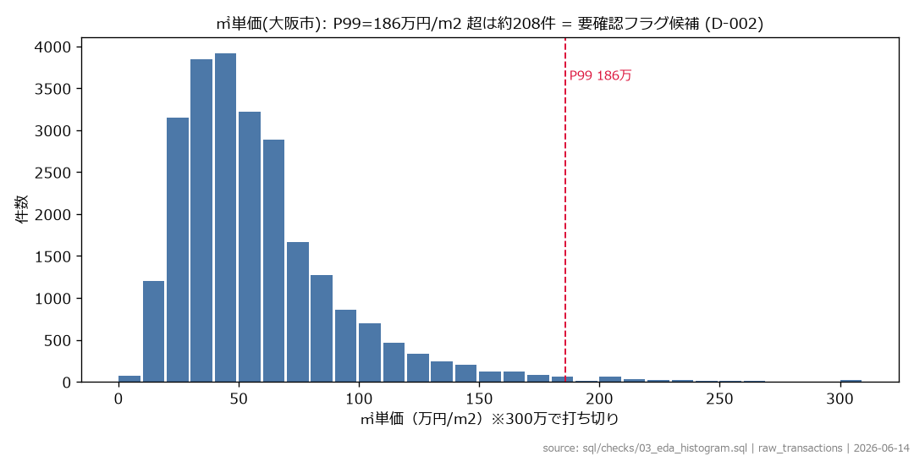
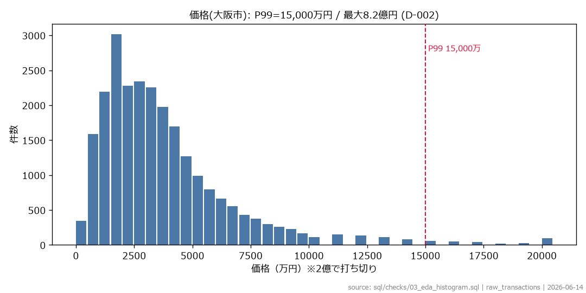
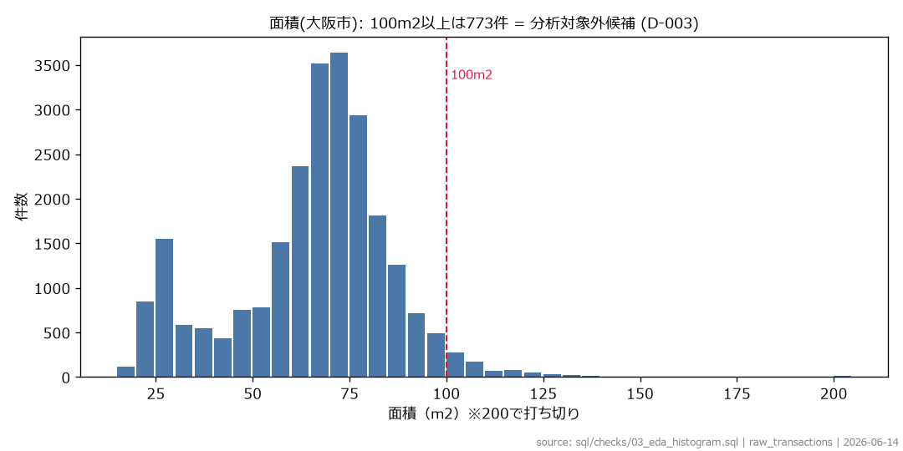
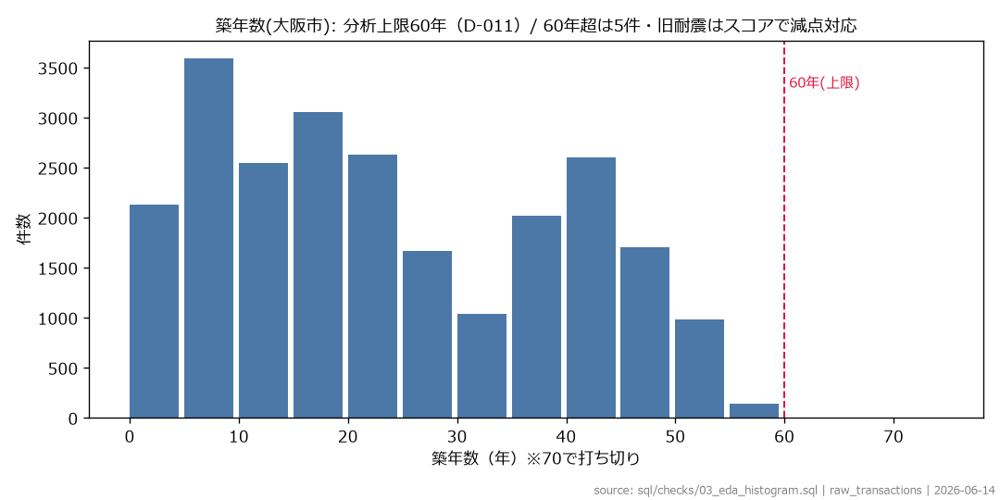
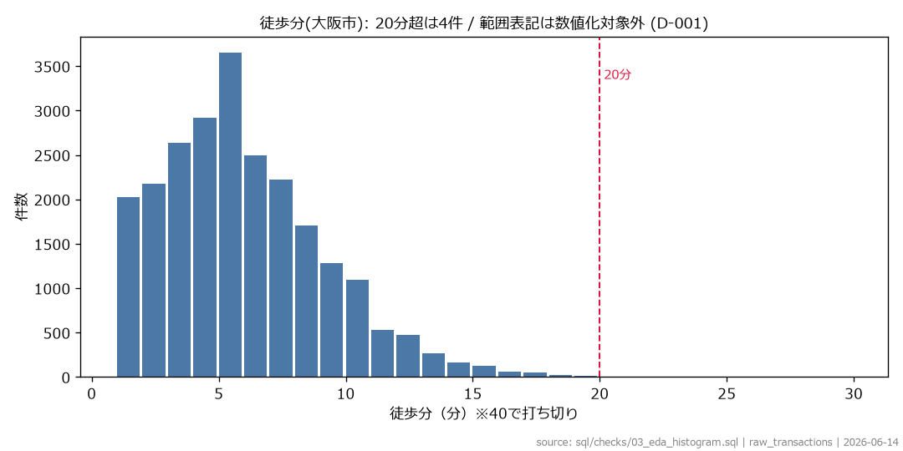
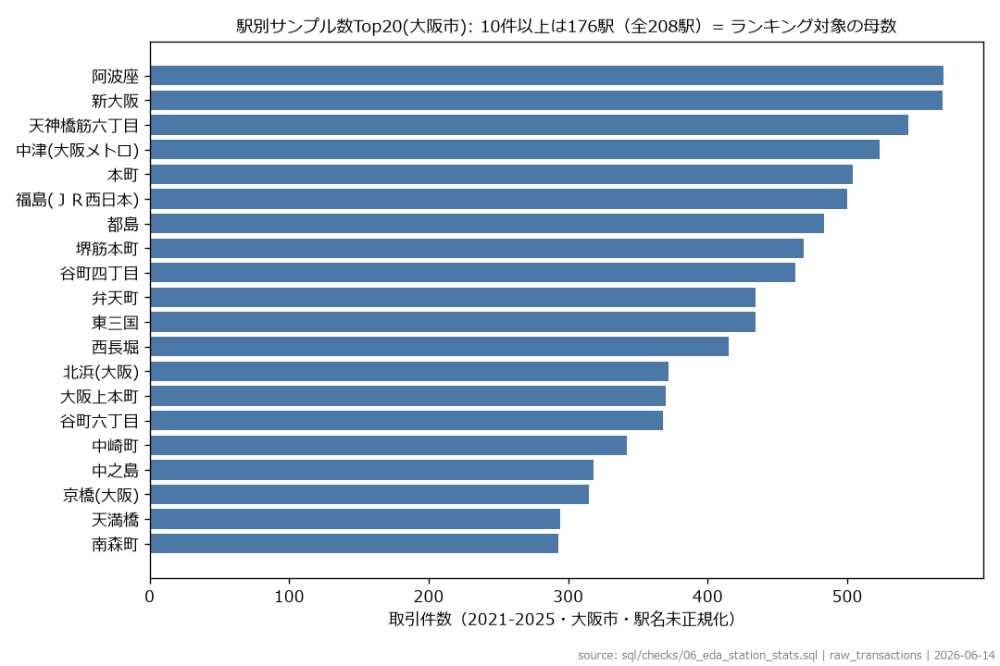
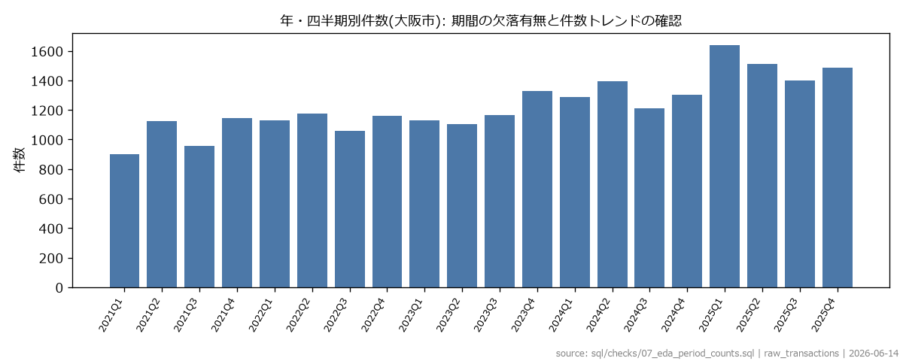

# EDA レポート (Step 5)

**データ取得日: 2026-06-12 / 対象スコープ: 大阪市・中古マンション等・成約価格情報 2021Q1-2025Q4（24,613行）。raw全体は大阪府47,386行で、形式チェックは府全体で実施済み（D-010）**
レポート生成: 2026-06-14 / 生成スクリプト: scripts/run_eda.py（全SQL・全グラフはこのスクリプトから再現可能）
注意: 成約価格情報は遡及改訂されるため、再取得時は件数が変わる可能性がある。

## 決定事項サマリー（D-001〜D-010 確定済み）

| ID | 内容 | ステータス |
|---|---|---|
| D-001 | 徒歩分の範囲表記: 大阪市で1件のみ（1H30〜2H）→ 徒歩20分フィルターで自動除外 | 不採用 |
| D-002 | 外れ値: 物理的ミスのみ除外（面積100m2超・㎡単価5万未満）。グレーゾーンは残しlog変換で対応 | 採用 |
| D-003 | 面積100m2超は scope_flag=FALSE・excluded_reason='area_out_of_scope' | 採用 |
| D-004 | 建築年「戦前」: 大阪市で0件のため実装不要 | 不採用 |
| D-005 | 完全重複219件: 全件保持 + potential_dup_flag=1（別部屋の同時成約と区別不能） | 採用 |
| D-006 | 駅名正規化3段階（括弧除去・「駅」除去・mapping CSV 7行）。mapping後の不一致0件見込み | 採用 |
| D-007 | 改装空欄23,558件（95.7%）→ renovation_unknown_flag=1。未改装と断定しない | 採用 |
| D-008 | 築年数マイナス2件（0.01%）→ building_age_years=0補正 + is_negative_age=1 | 採用 |
| D-009 | リーク防止: 時系列分割（訓練2021-2024・テスト2025）+ ウォークフォワード検証（訓練2021-2023・テスト2024）| 採用 |
| D-010 | EDAは大阪市スコープで実施。㎡単価P99が府全体158万→大阪市186万と大差 | 採用済み |
| D-011 | 分析条件: 面積20-60m2・徒歩20分以内・築5-60年・価格500万以上（上限なし）。価格上限を設けないことで駅別中央値の歪みを防止 | 採用 |

---

## 02. 数値プロファイル（min/P01/P25/中央値/P75/P99/max）

| metric | n_valid | min_v | p01 | p25 | p50 | p75 | p99 | max_v |
|---|---|---|---|---|---|---|---|---|
| age | 24137 | -2.0 | 1.0 | 10.0 | 21.0 | 38.0 | 53.0 | 76.0 |
| area | 24613 | 15.0 | 20.0 | 55.0 | 65.0 | 75.0 | 115.0 | 1960.0 |
| pps | 24613 | 8163.3 | 125000.0 | 340000.0 | 500000.0 | 706666.7 | 1857142.9 | 9647058.8 |
| price | 24613 | 1200000.0 | 4500000.0 | 1.8E7 | 3.1E7 | 4.7E7 | 1.5E8 | 8.2E8 |
| walk | 23924 | 1.0 | 1.0 | 3.0 | 5.0 | 7.0 | 15.0 | 29.0 |

**所見**: 価格は中央値3,100万円に対し最大8.2億円、
㎡単価はP99=186万円/m2。P01-P99の外側（両側約2%）が外れ値候補 = D-002。

<details><summary>実行SQL（sql/checks/02_eda_numeric_profile.sql）</summary>

```sql
WITH base AS (
  SELECT
    SAFE_CAST(trade_price_total AS INT64) AS price,
    SAFE_CAST(area_sqm AS FLOAT64) AS area,
    SAFE_DIVIDE(SAFE_CAST(trade_price_total AS INT64), SAFE_CAST(area_sqm AS FLOAT64)) AS pps,
    SAFE_CAST(SUBSTR(trade_period, 1, 4) AS INT64)
      - SAFE_CAST(REGEXP_EXTRACT(built_year, r'^([0-9]{4})年$') AS INT64) AS age,
    SAFE_CAST(nearest_station_distance_min AS INT64) AS walk,
    nearest_station_name AS st_name,
    built_year, trade_period, city_name, district_name, layout, renovation
  FROM `osaka_real_estate.raw_transactions`
  WHERE STARTS_WITH(city_name, '大阪市')
)
, m AS (
  SELECT 'price' AS metric, price AS v FROM base
  UNION ALL SELECT 'area', area FROM base
  UNION ALL SELECT 'pps', pps FROM base
  UNION ALL SELECT 'age', CAST(age AS FLOAT64) FROM base
  UNION ALL SELECT 'walk', CAST(walk AS FLOAT64) FROM base
)
SELECT metric, COUNT(v) AS n_valid,
  ROUND(MIN(v), 1) AS min_v,
  ROUND(APPROX_QUANTILES(v, 100)[OFFSET(1)], 1) AS p01,
  ROUND(APPROX_QUANTILES(v, 100)[OFFSET(25)], 1) AS p25,
  ROUND(APPROX_QUANTILES(v, 100)[OFFSET(50)], 1) AS p50,
  ROUND(APPROX_QUANTILES(v, 100)[OFFSET(75)], 1) AS p75,
  ROUND(APPROX_QUANTILES(v, 100)[OFFSET(99)], 1) AS p99,
  ROUND(MAX(v), 1) AS max_v
FROM m GROUP BY metric ORDER BY metric
```
</details>

## 03. 分布（ヒストグラム）







<details><summary>実行SQL（sql/checks/03_eda_histogram.sql）</summary>

```sql
WITH base AS (
  SELECT
    SAFE_CAST(trade_price_total AS INT64) AS price,
    SAFE_CAST(area_sqm AS FLOAT64) AS area,
    SAFE_DIVIDE(SAFE_CAST(trade_price_total AS INT64), SAFE_CAST(area_sqm AS FLOAT64)) AS pps,
    SAFE_CAST(SUBSTR(trade_period, 1, 4) AS INT64)
      - SAFE_CAST(REGEXP_EXTRACT(built_year, r'^([0-9]{4})年$') AS INT64) AS age,
    SAFE_CAST(nearest_station_distance_min AS INT64) AS walk,
    nearest_station_name AS st_name,
    built_year, trade_period, city_name, district_name, layout, renovation
  FROM `osaka_real_estate.raw_transactions`
  WHERE STARTS_WITH(city_name, '大阪市')
)
SELECT 'pps_10man' AS metric, CAST(FLOOR(LEAST(pps, 3000000) / 100000) AS INT64) AS bin_v, COUNT(*) AS cnt
FROM base WHERE pps IS NOT NULL GROUP BY 2
UNION ALL
SELECT 'price_500man', CAST(FLOOR(LEAST(price, 200000000) / 5000000) AS INT64), COUNT(*)
FROM base WHERE price IS NOT NULL GROUP BY 2
UNION ALL
SELECT 'area_5sqm', CAST(FLOOR(LEAST(area, 200) / 5) * 5 AS INT64), COUNT(*)
FROM base WHERE area IS NOT NULL GROUP BY 2
UNION ALL
SELECT 'age_5y', CAST(FLOOR(LEAST(age, 70) / 5) * 5 AS INT64), COUNT(*)
FROM base WHERE age IS NOT NULL AND age >= 0 GROUP BY 2
UNION ALL
SELECT 'walk_1min', CAST(LEAST(walk, 40) AS INT64), COUNT(*)
FROM base WHERE walk IS NOT NULL GROUP BY 2
ORDER BY metric, bin_v
```
</details>

## 04. 築年帯別IQR（箱ひげ）


| band | n | q1 | med | q3 | iqr | lower_fence | upper_fence | n_below | n_above |
|---|---|---|---|---|---|---|---|---|---|
| 不明 | 476 | 446154.0 | 600000.0 | 692308.0 | 246154.0 | 76923.0 | 1061538.0 | 2 | 8 |
| 築0-10年 | 6264 | 635294.0 | 800000.0 | 1085714.0 | 450420.0 | -40336.0 | 1761345.0 | 0 | 266 |
| 築11-20年 | 5671 | 475000.0 | 600000.0 | 766667.0 | 291667.0 | 37500.0 | 1204167.0 | 0 | 163 |
| 築21-30年 | 3894 | 383333.0 | 475000.0 | 571429.0 | 188095.0 | 101190.0 | 853571.0 | 0 | 75 |
| 築31-40年 | 3342 | 261538.0 | 326316.0 | 400000.0 | 138462.0 | 53846.0 | 607692.0 | 0 | 34 |
| 築41-50年 | 4150 | 228571.0 | 300000.0 | 381818.0 | 153247.0 | -1299.0 | 611688.0 | 0 | 31 |
| 築51-60年 | 811 | 151667.0 | 212500.0 | 266667.0 | 115000.0 | -20833.0 | 439167.0 | 0 | 16 |
| 築61年以上 | 5 | 133333.0 | 151429.0 | 486667.0 | 353333.0 | -396667.0 | 1016667.0 | 0 | 0 |

**所見**: 築年帯ごとにフェンスを引くことで「築古だから安い」を外れ値と誤判定しない（手順書No.7）。
フェンス外は D-002 の要確認フラグ対象。

<details><summary>実行SQL（sql/checks/04_eda_iqr_outliers.sql）</summary>

```sql
WITH base AS (
  SELECT
    SAFE_CAST(trade_price_total AS INT64) AS price,
    SAFE_CAST(area_sqm AS FLOAT64) AS area,
    SAFE_DIVIDE(SAFE_CAST(trade_price_total AS INT64), SAFE_CAST(area_sqm AS FLOAT64)) AS pps,
    SAFE_CAST(SUBSTR(trade_period, 1, 4) AS INT64)
      - SAFE_CAST(REGEXP_EXTRACT(built_year, r'^([0-9]{4})年$') AS INT64) AS age,
    SAFE_CAST(nearest_station_distance_min AS INT64) AS walk,
    nearest_station_name AS st_name,
    built_year, trade_period, city_name, district_name, layout, renovation
  FROM `osaka_real_estate.raw_transactions`
  WHERE STARTS_WITH(city_name, '大阪市')
)
, banded AS (
  SELECT pps,
    CASE WHEN age IS NULL THEN '不明'
         WHEN age <= 10 THEN '築0-10年' WHEN age <= 20 THEN '築11-20年'
         WHEN age <= 30 THEN '築21-30年' WHEN age <= 40 THEN '築31-40年'
         WHEN age <= 50 THEN '築41-50年' WHEN age <= 60 THEN '築51-60年'
         ELSE '築61年以上' END AS band
  FROM base WHERE pps IS NOT NULL
),
stats AS (
  SELECT band,
    APPROX_QUANTILES(pps, 4)[OFFSET(1)] AS q1,
    APPROX_QUANTILES(pps, 4)[OFFSET(2)] AS q2,
    APPROX_QUANTILES(pps, 4)[OFFSET(3)] AS q3,
    COUNT(*) AS n
  FROM banded GROUP BY band
)
SELECT s.band, s.n, ROUND(s.q1) AS q1, ROUND(s.q2) AS med, ROUND(s.q3) AS q3,
  ROUND(s.q3 - s.q1) AS iqr,
  ROUND(s.q1 - 1.5 * (s.q3 - s.q1)) AS lower_fence,
  ROUND(s.q3 + 1.5 * (s.q3 - s.q1)) AS upper_fence,
  COUNTIF(b.pps < s.q1 - 1.5 * (s.q3 - s.q1)) AS n_below,
  COUNTIF(b.pps > s.q3 + 1.5 * (s.q3 - s.q1)) AS n_above
FROM stats s JOIN banded b ON b.band = s.band
GROUP BY s.band, s.n, s.q1, s.q2, s.q3 ORDER BY s.band
```
</details>

## 05. 駅名結合率（raw駅名 × N02-2025駅マスタ）

| section | names_matched_raw | names_matched_norm | names_total | rows_matched_norm | rows_total |
|---|---|---|---|---|---|
| A_summary | 168 | 201 | 208 | 23321 | 24144 |
| B_unmatched_top | 四天王寺前夕陽ケ丘 | 四天王寺前夕陽ケ丘 | 287 |  |  |
| B_unmatched_top | ＪＲ難波 | ＪＲ難波 | 163 |  |  |
| B_unmatched_top | なんば(大阪メトロ) | なんば | 119 |  |  |
| B_unmatched_top | あびこ | あびこ | 113 |  |  |
| B_unmatched_top | 鶴ケ丘 | 鶴ケ丘 | 56 |  |  |
| B_unmatched_top | ＪＲ淡路 | ＪＲ淡路 | 43 |  |  |
| B_unmatched_top | ＪＲ野江 | ＪＲ野江 | 42 |  |  |

**所見**: A_summary行 = [生駅名の一致数, 正規化後の一致数, 駅名総数, 正規化後一致行数, 駅名あり行総数]。
B_unmatched_top = 正規化しても一致しない駅名（mapping CSV の対象 = D-006）。

<details><summary>実行SQL（sql/checks/05_eda_station_join.sql）</summary>

```sql
WITH tx AS (
  SELECT nearest_station_name AS nm, COUNT(*) AS c
  FROM `osaka_real_estate.raw_transactions`
  WHERE nearest_station_name != '' AND STARTS_WITH(city_name, '大阪市') GROUP BY 1
),
norm AS (
  SELECT nm, c,
    REGEXP_REPLACE(REGEXP_REPLACE(nm, r'\([^)]*\)|（[^）]*）', ''), r'駅$', '') AS nm_norm
  FROM tx
),
st AS (SELECT DISTINCT n02_005 AS s FROM `osaka_real_estate.raw_station_master_2025`)
SELECT 'A_summary' AS section,
  CAST(COUNTIF(s1.s IS NOT NULL) AS STRING) AS names_matched_raw,
  CAST(COUNTIF(s2.s IS NOT NULL) AS STRING) AS names_matched_norm,
  CAST(COUNT(*) AS STRING) AS names_total,
  CAST(SUM(IF(s2.s IS NOT NULL, n.c, 0)) AS STRING) AS rows_matched_norm,
  CAST(SUM(n.c) AS STRING) AS rows_total
FROM norm n
LEFT JOIN st s1 ON n.nm = s1.s
LEFT JOIN st s2 ON n.nm_norm = s2.s
UNION ALL
SELECT 'B_unmatched_top', n.nm, n.nm_norm, CAST(n.c AS STRING), '', ''
FROM norm n LEFT JOIN st s2 ON n.nm_norm = s2.s
WHERE s2.s IS NULL
ORDER BY section, CAST(names_total AS INT64) DESC
LIMIT 30
```
</details>

## 06. 駅別サンプル数



**所見**: 10件以上の駅がランキング対象の母数（手順書の最低ライン）。詳細は outputs/tables/06_eda_station_stats.csv。

<details><summary>実行SQL（sql/checks/06_eda_station_stats.sql）</summary>

```sql
WITH base AS (
  SELECT
    SAFE_CAST(trade_price_total AS INT64) AS price,
    SAFE_CAST(area_sqm AS FLOAT64) AS area,
    SAFE_DIVIDE(SAFE_CAST(trade_price_total AS INT64), SAFE_CAST(area_sqm AS FLOAT64)) AS pps,
    SAFE_CAST(SUBSTR(trade_period, 1, 4) AS INT64)
      - SAFE_CAST(REGEXP_EXTRACT(built_year, r'^([0-9]{4})年$') AS INT64) AS age,
    SAFE_CAST(nearest_station_distance_min AS INT64) AS walk,
    nearest_station_name AS st_name,
    built_year, trade_period, city_name, district_name, layout, renovation
  FROM `osaka_real_estate.raw_transactions`
  WHERE STARTS_WITH(city_name, '大阪市')
)
SELECT st_name, COUNT(*) AS cnt,
  ROUND(APPROX_QUANTILES(pps, 100)[OFFSET(50)]) AS median_pps
FROM base WHERE st_name != '' AND pps IS NOT NULL
GROUP BY st_name ORDER BY cnt DESC
```
</details>

## 07. 年・四半期別件数



<details><summary>実行SQL（sql/checks/07_eda_period_counts.sql）</summary>

```sql
SELECT
  SUBSTR(trade_period, 1, 4) AS yr,
  REGEXP_EXTRACT(trade_period, r'第([1-4])') AS qtr,
  COUNT(*) AS cnt
FROM `osaka_real_estate.raw_transactions`
WHERE STARTS_WITH(city_name, '大阪市')
GROUP BY 1, 2 ORDER BY 1, 2
```
</details>

## 08. 欠損・特殊値・重複


| section | item | cnt |
|---|---|---|
| dup_rows | excess_total | 219 |
| empty | use_type | 24613 |
| empty | renovation | 23558 |
| empty | city_planning | 3496 |
| empty | nearest_station_distance_min | 688 |
| empty | built_year | 476 |
| empty | nearest_station_name | 469 |
| empty | layout | 1 |
| renovation_value | 改装済み | 1055 |
| walk_range | 1H30～2H | 1 |

**所見**: 徒歩分の範囲表記（D-001）、「戦前」（D-004）、完全重複（D-005）、改装空欄（D-007）の根拠データ。
徒歩分空欄688件（nearest_station_distance_min）はD-011の `walk <= 20` フィルターでNULLを満たさず自動除外される。

<details><summary>実行SQL（sql/checks/08_eda_missing_special.sql）</summary>

```sql
WITH t AS (
  SELECT * FROM `osaka_real_estate.raw_transactions` WHERE STARTS_WITH(city_name, '大阪市'))
SELECT 'empty' AS section, 'nearest_station_name' AS item, CAST(COUNTIF(nearest_station_name = '') AS INT64) AS cnt FROM t
UNION ALL SELECT 'empty', 'nearest_station_distance_min', COUNTIF(nearest_station_distance_min = '') FROM t
UNION ALL SELECT 'empty', 'built_year', COUNTIF(built_year = '') FROM t
UNION ALL SELECT 'empty', 'renovation', COUNTIF(renovation = '') FROM t
UNION ALL SELECT 'empty', 'layout', COUNTIF(layout = '') FROM t
UNION ALL SELECT 'empty', 'use_type', COUNTIF(use_type = '') FROM t
UNION ALL SELECT 'empty', 'city_planning', COUNTIF(city_planning = '') FROM t
UNION ALL SELECT 'walk_range', nearest_station_distance_min, COUNT(*) FROM t
  WHERE nearest_station_distance_min != '' AND SAFE_CAST(nearest_station_distance_min AS INT64) IS NULL
  GROUP BY 2
UNION ALL SELECT 'built_special', built_year, COUNT(*) FROM t
  WHERE built_year != '' AND NOT REGEXP_CONTAINS(built_year, r'^[0-9]{4}年$') GROUP BY 2
UNION ALL SELECT 'renovation_value', renovation, COUNT(*) FROM t WHERE renovation != '' GROUP BY 2
UNION ALL
SELECT 'dup_rows', 'excess_total', SUM(c - 1) FROM (
  SELECT COUNT(*) AS c FROM t
  GROUP BY kind, price_category, city_code, prefecture_name, city_name, district_name,
    nearest_station_name, nearest_station_distance_min, trade_price_total, layout, area_sqm,
    built_year, building_structure, use_type, future_use_purpose, city_planning,
    building_coverage_ratio, floor_area_ratio, trade_period, renovation, trade_circumstances
  HAVING c > 1)
ORDER BY section, cnt DESC
```
</details>

## 09. 外れ値の現物確認（統計値でなく実データで判断）

| section | city_name | district_name | st_name | walk | area | price_man | pps_man | built_year | layout | trade_period |
|---|---|---|---|---|---|---|---|---|---|---|
| pps_bottom5 | 大阪市港区 | 田中 | 朝潮橋 | 6 | 60.0 | 300.0 | 5.0 |  | ４Ｋ | 2023年第2四半期 |
| pps_bottom5 | 大阪市平野区 | 加美西 | 加美 | 5 | 45.0 | 200.0 | 4.4 | 1974年 | ２ＤＫ | 2023年第2四半期 |
| pps_bottom5 | 大阪市東淀川区 | 下新庄 | 下新庄 | 6 | 55.0 | 230.0 | 4.2 | 1968年 | ３ＤＫ | 2025年第4四半期 |
| pps_bottom5 | 大阪市港区 | 築港 | 大阪港 | 3 | 65.0 | 150.0 | 2.3 | 1969年 | ３Ｋ | 2021年第3四半期 |
| pps_bottom5 | 大阪市福島区 | 吉野 |  |  | 1960.0 | 1600.0 | 0.8 |  | １Ｋ | 2024年第4四半期 |
| pps_top5 | 大阪市北区 | 天神橋 | 天神橋筋六丁目 | 1 | 85.0 | 82000.0 | 964.7 | 2013年 | ２ＬＤＫ | 2021年第2四半期 |
| pps_top5 | 大阪市西区 | 西本町 | 本町 | 4 | 50.0 | 20000.0 | 400.0 | 1980年 | １ＬＤＫ | 2022年第1四半期 |
| pps_top5 | 大阪市北区 | 大深町 | 大阪 | 6 | 95.0 | 37000.0 | 389.5 | 2013年 | １ＬＤＫ | 2025年第3四半期 |
| pps_top5 | 大阪市北区 | 大深町 | 大阪 | 6 | 105.0 | 40000.0 | 381.0 | 2013年 | ３ＬＤＫ | 2025年第4四半期 |
| pps_top5 | 大阪市北区 | 堂島 | 西梅田 | 6 | 80.0 | 30000.0 | 375.0 | 2024年 | １ＬＤＫ | 2024年第2四半期 |
| price_top5 | 大阪市北区 | 天神橋 | 天神橋筋六丁目 | 1 | 85.0 | 82000.0 | 964.7 | 2013年 | ２ＬＤＫ | 2021年第2四半期 |
| price_top5 | 大阪市北区 | 大深町 | 大阪 | 6 | 105.0 | 40000.0 | 381.0 | 2013年 | ３ＬＤＫ | 2025年第4四半期 |
| price_top5 | 大阪市中央区 | 南本町 | 堺筋本町 | 1 | 210.0 | 57000.0 | 271.4 | 2021年 | ２ＬＤＫ | 2023年第4四半期 |
| price_top5 | 大阪市中央区 | 南本町 | 堺筋本町 | 1 | 175.0 | 45000.0 | 257.1 | 2021年 | ２ＬＤＫ | 2025年第2四半期 |
| price_top5 | 大阪市福島区 | 福島 | 新福島 | 3 | 235.0 | 45000.0 | 191.5 | 2008年 | ２ＬＤＫ | 2021年第4四半期 |

**所見**: price_top5・pps_top5 は全件が面積60m²超（D-011スコープ外）または面積100m²超（D-003対象）。立地で説明できる実在の高級物件であり入力ミスではないが分析対象外となる（例外: 本町50m²・2億円はpps=400万/m²でスコープ内・IQRフェンス外フラグ候補）。
pps_bottom5 最下位の大阪市福島区吉野（area=1960.0m²・1K・pps=0.8万）は**入力ミスと判断**: 1Kで1960m²は物理的にあり得ず、「1960年築」の年が面積欄に誤入力された可能性が高い。D-002（pps<5万/m²）とD-003（面積100m²超）の両方で除外対象。

<details><summary>実行SQL（sql/checks/09_eda_outlier_examples.sql）</summary>

```sql
WITH base AS (
  SELECT
    SAFE_CAST(trade_price_total AS INT64) AS price,
    SAFE_CAST(area_sqm AS FLOAT64) AS area,
    SAFE_DIVIDE(SAFE_CAST(trade_price_total AS INT64), SAFE_CAST(area_sqm AS FLOAT64)) AS pps,
    SAFE_CAST(SUBSTR(trade_period, 1, 4) AS INT64)
      - SAFE_CAST(REGEXP_EXTRACT(built_year, r'^([0-9]{4})年$') AS INT64) AS age,
    SAFE_CAST(nearest_station_distance_min AS INT64) AS walk,
    nearest_station_name AS st_name,
    built_year, trade_period, city_name, district_name, layout, renovation
  FROM `osaka_real_estate.raw_transactions`
  WHERE STARTS_WITH(city_name, '大阪市')
)
SELECT * FROM (
  SELECT 'price_top5' AS section, city_name, district_name, st_name, walk,
    area, ROUND(price / 10000) AS price_man, ROUND(pps / 10000, 1) AS pps_man,
    built_year, layout, trade_period
  FROM base WHERE price IS NOT NULL ORDER BY price DESC LIMIT 5)
UNION ALL
SELECT * FROM (
  SELECT 'pps_top5', city_name, district_name, st_name, walk, area,
    ROUND(price / 10000), ROUND(pps / 10000, 1), built_year, layout, trade_period
  FROM base WHERE pps IS NOT NULL ORDER BY pps DESC LIMIT 5)
UNION ALL
SELECT * FROM (
  SELECT 'pps_bottom5', city_name, district_name, st_name, walk, area,
    ROUND(price / 10000), ROUND(pps / 10000, 1), built_year, layout, trade_period
  FROM base WHERE pps IS NOT NULL ORDER BY pps ASC LIMIT 5)
ORDER BY section, pps_man DESC
```
</details>

## 10. Step 6 確定条件（D-011）適用結果

| 絞り込みステップ | 残件数 |
|---|---|
| 0_全件(大阪府) | 47,386 |
| 1_大阪市内 | 24,613 |
| 2_+面積20-60 | 9,368 |
| 3_+徒歩20分以内 | 8,972 |
| 4_+築5-60年 | 8,044 |
| 5_+価格500万以上 | 7,796 |

- 条件後の駅数: 188駅 / うち10件以上: **134駅**

**所見**: 確定条件（D-011: 大阪市・20-60m2・徒歩20分・築5-60年・500万円以上・価格上限なし）での残件数。
価格上限を設けない根拠: 上限8000万で打ち切ると都市部（北区・中央区等）の駅別中央値が実態より低くなり、割安度スコアが歪む（D-011）。
面積下限20m²の根拠: 15-19m²はトランクルーム・特殊区分所有・事務所転用の可能性があり居住用マンションとして実態不明のため除外。
面積上限60m²の根拠: テーマ（単身・DINKS・投資）に合致しつつ、55m2上限（市場の28%のみ）より2.4倍の件数を確保。
築年数下限5年の根拠: 築0-4年は新築プレミアム（デベロッパー利益・広告費）が価格に上乗せされており中古相場と乖離するため除外。
築年数上限60年の根拠: P99=53年をカバーしつつmax76年の外れ値を除外。旧耐震（築45年以上）はスコアの減点で対応。

<details><summary>実行SQL（sql/checks/10_eda_scope_preview.sql）</summary>

```sql
WITH base AS (
  SELECT
    SAFE_CAST(trade_price_total AS INT64) AS price,
    SAFE_CAST(area_sqm AS FLOAT64) AS area,
    SAFE_DIVIDE(SAFE_CAST(trade_price_total AS INT64), SAFE_CAST(area_sqm AS FLOAT64)) AS pps,
    SAFE_CAST(SUBSTR(trade_period, 1, 4) AS INT64)
      - SAFE_CAST(REGEXP_EXTRACT(built_year, r'^([0-9]{4})年$') AS INT64) AS age,
    SAFE_CAST(nearest_station_distance_min AS INT64) AS walk,
    nearest_station_name AS st_name,
    built_year, trade_period, city_name, district_name, layout, renovation
  FROM `osaka_real_estate.raw_transactions`
)
-- 確定条件（D-011）: 大阪市・面積20-60m2・徒歩20分・築5-60年・価格500万以上（上限なし）
, scoped AS (
  SELECT *, STARTS_WITH(city_name, '大阪市') AS in_osaka_city,
    (area BETWEEN 20 AND 60) AS ok_area, (walk <= 20) AS ok_walk,
    (age BETWEEN 5 AND 60) AS ok_age,
    (price >= 5000000) AS ok_price
  FROM base
)
SELECT 'A_funnel' AS section, '0_全件(大阪府)' AS step, CAST(COUNT(*) AS INT64) AS cnt FROM scoped
UNION ALL SELECT 'A_funnel', '1_大阪市内', COUNTIF(in_osaka_city) FROM scoped
UNION ALL SELECT 'A_funnel', '2_+面積20-60', COUNTIF(in_osaka_city AND ok_area) FROM scoped
UNION ALL SELECT 'A_funnel', '3_+徒歩20分以内', COUNTIF(in_osaka_city AND ok_area AND ok_walk) FROM scoped
UNION ALL SELECT 'A_funnel', '4_+築5-60年', COUNTIF(in_osaka_city AND ok_area AND ok_walk AND ok_age) FROM scoped
UNION ALL SELECT 'A_funnel', '5_+価格500万以上', COUNTIF(in_osaka_city AND ok_area AND ok_walk AND ok_age AND ok_price) FROM scoped
UNION ALL
SELECT 'B_station', '駅数(条件後10件以上)', COUNT(*) FROM (
  SELECT st_name FROM scoped
  WHERE in_osaka_city AND ok_area AND ok_walk AND ok_age AND ok_price AND st_name != ''
  GROUP BY st_name HAVING COUNT(*) >= 10)
UNION ALL
SELECT 'B_station', '駅数(条件後1件以上)', COUNT(*) FROM (
  SELECT st_name FROM scoped
  WHERE in_osaka_city AND ok_area AND ok_walk AND ok_age AND ok_price AND st_name != ''
  GROUP BY st_name)
ORDER BY section, step
```
</details>
